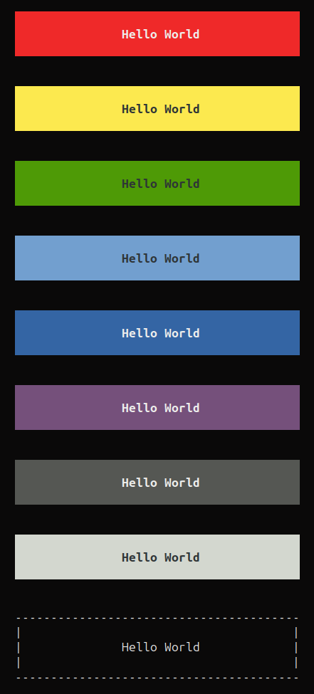

pop-console
===========

[](https://github.com/popphp/pop-console/actions)
[](http://cc.popphp.org/pop-console/)

[](https://popphp.slack.com)
[](https://discord.gg/TZjgT74U7E)

* [Overview](#overview)
* [Install](#install)
* [Quickstart](#quickstart)
* [Response Buffer](#response-buffer)
* [Colors](#colors)
* [Lines](#lines)
* [Headers](#headers)
* [Alerts](#alerts)
* [Prompt](#prompt)
* [Commands](#commands)
* [Help Screen](#help-screen)

Overview
--------
`pop-console` provides a layer to run an application from the console terminal and produce formatted
output to the terminal window. It has support for commands and their parameters, as well ANSI-based
console colors. It can be easily be used with an application built with Pop to route requests
from the CLI to the application.

`pop-console` is a component of the [Pop PHP Framework](http://www.popphp.org/).

**Note**

The code below represents basic examples. Ideally, you could wire an application to use the console
for outputting content to the terminal screen, but not for setting routes, controllers and actions.
Refer to the [Pop PHP Tutorial](https://github.com/popphp/popphp-tutorial) example application to see how to wire up a CLI-based application
complete with routes using Pop PHP.

[Top](#pop-console)

Install
-------

Install `pop-console` using Composer.

    composer require popphp/pop-console

Or, require it in your composer.json file

    "require": {
        "popphp/pop-console" : "^4.1.0"
    }

[Top](#pop-console)

Quickstart
----------

### Outputting to the console

You can use a console object to manage and deploy output to the console, including
a prepended header and appended footer.

```php
use Pop\Console\Console;

$console = new Console();
$console->setHeader('My Application'); // Set a global header at the start of the script
$console->setFooter('The End');        // Set a global footer at the end of the script

$console->append('Here is some console information.');
$console->append('Hope you enjoyed it!');
$console->send();
```

The above will output:

```text
    My Application
    
    Here is some console information.
    Hope you enjoyed it!

    The End
```

### Console wrap and margin

By default, the console object enforces a wrap width at 80 characters and provides a margin of 4 spaces for readability.
These values can be changed to whatever is needed for the application.

```php
use Pop\Console\Console;

$console = new Console(40, 2); // wrap width of 40, margin of 2 spaces
$console->append(
    'Here is some console information. This is a really long string. It will have to wrap.'
);
$console->send();
```

```text
  Here is some console information. This
  is a really long string. It will have to
  wrap.
```

[Top](#pop-console)

Response Buffer
---------------

### Append vs Write

In the above examples, the method `append()` was used in conjunction with `send()`. The method `append()`
appends the content to the response buffer, which will only get produced to the terminal screen when the
method `send()` is called. This is useful if you have to take a number of steps to create the response buffer
before sending it.

Using the method `write()` allows you to produce content to the terminal screen in real time, without
having to call the `send()` method. This is useful if you need to push content out to the terminal screen
of the application as you go.

```php
use Pop\Console\Console;

$console = new Console(40);
$console->write(
    'Here is some console information. This is a really long string. It will have to wrap.'
);
```

### Newline and Margin

By default, calling the `append()` or `write()` methods will produce the margin value at the beginning
of the content and a newline at the end of the content. If this is not the desired behavior, boolean flags
can be passed to control this:

```php
use Pop\Console\Console;

$console = new Console(40);
$console->write('Here ', false);          // No new line, but use margin
$console->write('is ', false, false);     // No new line, no margin
$console->write('some ', false, false);   // No new line, no margin
$console->write('content.', true, false); // Use new line, but no margin
```

[Top](#pop-console)

Colors
------

On a console terminal that supports it, you can colorize text outputted to the console
with the ``Pop\Console\Color::colorize()`` method:

```php
use Pop\Console\Console;
use Pop\Console\Color;

$console = new Console();
$console->write(
    'Here is some ' . 
    Color::colorize('IMPORTANT', Color::BOLD_RED) .
    ' console information.'
);
```

Available color constants include:

- NORMAL
- BLACK
- RED
- GREEN
- YELLOW
- BLUE
- MAGENTA
- CYAN
- WHITE
- BRIGHT_BLACK
- BRIGHT_RED
- BRIGHT_GREEN
- BRIGHT_YELLOW
- BRIGHT_BLUE
- BRIGHT_MAGENTA
- BRIGHT_CYAN
- BRIGHT_WHITE
- BOLD_BLACK
- BOLD_RED
- BOLD_GREEN
- BOLD_YELLOW
- BOLD_BLUE
- BOLD_MAGENTA
- BOLD_CYAN
- BOLD_WHITE
- BRIGHT_BOLD_BLACK
- BRIGHT_BOLD_RED
- BRIGHT_BOLD_GREEN
- BRIGHT_BOLD_YELLOW
- BRIGHT_BOLD_BLUE
- BRIGHT_BOLD_MAGENTA
- BRIGHT_BOLD_CYAN
- BRIGHT_BOLD_WHITE

[Top](#pop-console)

Lines
-----

The `line()` method provides a way to print a horizontal line rule out to the terminal. The default
character for the line is a dash `-`, but any character can be passed into the method.

```php
use Pop\Console\Console;

$console = new Console();
$console->line();
```

```text
    ----------------------------------------
```

It will default to the wrap width of the console object. If no wrap width is available, it will take on
the width of the terminal, unless a custom width is specified:

```php
use Pop\Console\Console;

$console = new Console();
$console->line('=', 20);
```

```text
    ====================
```

[Top](#pop-console)

Headers
-------

The `header()` method provides a way to output a separate block of text with an underline emphasis:

```php
use Pop\Console\Console;

$console = new Console(80);
$console->header('Hello World');
```

```text
    Hello World
    -----------
```

The character, size and alignment can be controlled as well:

```php
use Pop\Console\Console;

$console = new Console();
$console->header('Hello World', '=', 40, 'center');
```

```text
                   Hello World
    ========================================
```

[Top](#pop-console)

Alerts
------

Alerts are specially formatted boxes that provide style and enhancement to the user's experience
in regard to important information and notifications.

```php
use Pop\Console\Console;

$console = new Console(40);
$console->alertDanger('Hello World', 'auto');
$console->alertWarning('Hello World', 'auto');
$console->alertSuccess('Hello World', 'auto');
$console->alertInfo('Hello World', 'auto');
$console->alertPrimary('Hello World', 'auto');
$console->alertSecondary('Hello World', 'auto');
$console->alertDark('Hello World', 'auto');
$console->alertLight('Hello World', 'auto');
$console->alertBox('Hello World', '-', '|', 'auto');
```

The `alertBox()` method produces a colorless alert box with a border made of character strings.
The above code will produce the following output to the console terminal:



[Top](#pop-console)

Prompt
------

You can trigger a prompt to get information from the user:

```php
use Pop\Console\Console;

$console = new Console();
$name    = $console->prompt('Please provide your name: ');
$console->write('Hello ' . $name . '!');
```

```bash
$ ./app
    Please provide your name:  Nick
    Hello Nick!
```

You can also enforce a certain set of options as well as case-sensitivity.
The prompt will not accept a value outside of the provided range of option
values. If the case-sensitive flag is set to `true`, the prompt will not
accept values that are not an exact case-match.

```php
use Pop\Console\Console;

$console = new Console();
$letter  = $console->prompt(
    'Which is your favorite letter: A, B, C, or D? ',
    ['A', 'B', 'C', 'D'],
    true
);
$console->write('Your favorite letter is ' . $letter . '.');
```

```bash
$ ./app
    Which is your favorite letter: A, B, C, or D? B
    Your favorite letter is B.
```

### Confirm

The `confirm()` is a shorthand version of a prompt to ask if the user is sure they want to proceed,
else the application will exit:

```php
use Pop\Console\Console;

$console = new Console();
$console->confirm();
$console->write('The user said yes.');
```

```text
    Are you sure? [Y/N] y
    The user said yes.
```

[Top](#pop-console)

Commands
--------

A command object allows you to define the name, parameters and help string values of a command
and add the command to the console object:

```php
use Pop\Console\Console;
use Pop\Console\Command;

$command1 = new Command('users');
$command1->setParams('--list [<id>]');
$command1->setHelp('This is the users help screen');

$command2 = new Command('roles');
$command2->setParams('--list [<id>]');
$command2->setHelp('This is the roles help screen');

$console = new Console();
$console->addCommand($command1);
$console->addCommand($command2);
```

[Top](#pop-console)

Help Screen
-----------

Registering the commands with the console object like in the above example allows you
to call the `help()` method to view the auto-generated help screen:

```php
$console->help();
```

```text
    users --list [<id>]    This is the users help screen
    roles --list [<id>]    This is the roles help screen
```

However, the console object has the method `addCommandsFromRoutes()` which works in conjunction
with a `Pop\Router\Cli\Match` object to automatically generate the command, along with their
parameters and help strings.

```php
use Pop\Console\Console;

$this->console->addCommandsFromRoutes($cliRouteMatch, './myapp');
```

This console will use the CLI route match object and parse out all of the commands
and make them available for the console object to leverage for the help screen.

### Help colors

An extra layer of presentation control is available by way of setting the help screen colors.
You can choose up to 4 colors that will be used in breaking apart the command strings by name
and parameters and colorizing them to make the different segments standout in an organized fashion.

Let's take a look at the abstract constructor of the `pop-kettle` component.

```php
    public function __construct(Application $application, Console $console)
    {
        $this->application = $application;
        $this->console     = $console;

        $this->console->setHelpColors(
            Color::BOLD_CYAN, Color::BOLD_GREEN, Color::BOLD_MAGENTA
            );
        $this->console->addCommandsFromRoutes(
            $application->router()->getRouteMatch(), './kettle'
        );
    }

    public function help()
    {
        $this->console->help();
    }
```

In the above constructor method, the help colors are set and then the application object pushes
the CLI route match object into the console method `addCommandsFromRoutes()`. The second parameter
`./kettle` is a script prefix to prepend to each line of help. Those two lines are all that is needed
to produce the colorful and well organized help screen for `pop-kettle`, which is called within the
controller's `help()` method.

The output looks like this:


[Top](#pop-console)
