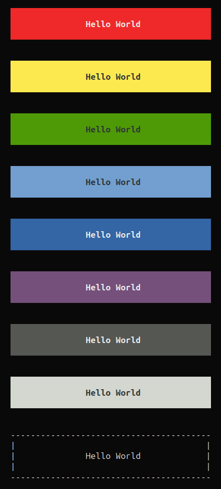
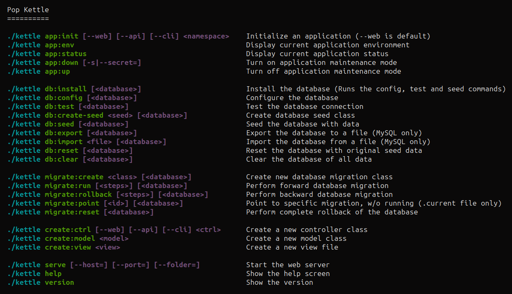

pop-console
===========

[](https://github.com/popphp/pop-console/actions)
[](http://cc.popphp.org/pop-console/)

[](https://discord.gg/TZjgT74U7E)

* [Overview](#overview)
* [Install](#install)
* [Quickstart](#quickstart)
* [Response Buffer](#response-buffer)
* [Colors](#colors)
* [Lines](#lines)
* [Headers](#headers)
* [Alerts](#alerts)
* [Prompt](#prompt)
* [Table](#table)
* [Progress Bar](#progress-bar)
* [Utilities](#utilities)
* [Commands](#commands)
* [Command Registry](#command-registry)
* [Help Screen](#help-screen)

Overview
--------
`pop-console` provides a layer to run an application from the console terminal and produce formatted
output to the terminal window. It has support for commands and their parameters, as well ANSI-based
console colors. It can be easily be used with an application built with Pop to route requests
from the CLI to the application.

`pop-console` is a component of the [Pop PHP Framework](https://www.popphp.org/).

**Note**

The code below represents basic examples. Ideally, you could wire an application to use the console
for outputting content to the terminal screen, but not for setting routes, controllers and actions.
Refer to the [Pop PHP Tutorial](https://github.com/popphp/popphp-tutorial) example application to see how to wire up a CLI-based application
complete with routes using Pop PHP.

[Top](#pop-console)

Install
-------

Install `pop-console` using Composer.

    composer require popphp/pop-console

Or, require it in your composer.json file

    "require": {
        "popphp/pop-console" : "^5.0.0"
    }

[Top](#pop-console)

Quickstart
----------

### Outputting to the console

You can use a console object to manage and deploy output to the console, including
a prepended header and appended footer.

```php
use Pop\Console\Console;

$console = new Console();
$console->setHeader('My Application'); // Set a global header at the start of the script
$console->setFooter('The End');        // Set a global footer at the end of the script

$console->append('Here is some console information.');
$console->append('Hope you enjoyed it!');
$console->send();
```

The above will output:

```text
    My Application
    
    Here is some console information.
    Hope you enjoyed it!

    The End
```

### Console wrap and margin

By default, the console object enforces a wrap width at 80 characters and provides a margin of 4 spaces for readability.
These values can be changed to whatever is needed for the application.

```php
use Pop\Console\Console;

$console = new Console(40, 2); // wrap width of 40, margin of 2 spaces
$console->append(
    'Here is some console information. This is a really long string. It will have to wrap.'
);
$console->send();
```

```text
  Here is some console information. This
  is a really long string. It will have to
  wrap.
```

[Top](#pop-console)

Response Buffer
---------------

### Append vs Write

In the above examples, the method `append()` was used in conjunction with `send()`. The method `append()`
appends the content to the response buffer, which will only get produced to the terminal screen when the
method `send()` is called. This is useful if you have to take a number of steps to create the response buffer
before sending it.

Using the method `write()` allows you to produce content to the terminal screen in real time, without
having to call the `send()` method. This is useful if you need to push content out to the terminal screen
of the application as you go.

```php
use Pop\Console\Console;

$console = new Console(40);
$console->write(
    'Here is some console information. This is a really long string. It will have to wrap.'
);
```

### Newline and Margin

By default, calling the `append()` or `write()` methods will produce the margin value at the beginning
of the content and a newline at the end of the content. If this is not the desired behavior, boolean flags
can be passed to control this:

```php
use Pop\Console\Console;

$console = new Console(40);
$console->write('Here ', false);          // No new line, but use margin
$console->write('is ', false, false);     // No new line, no margin
$console->write('some ', false, false);   // No new line, no margin
$console->write('content.', true, false); // Use new line, but no margin
```

[Top](#pop-console)

Colors
------

On a console terminal that supports it, you can colorize text outputted to the console
with the ``colorize()`` method:

```php
use Pop\Console\Console;
use Pop\Console\Color;

$console = new Console();
$console->write(
    'Here is some ' . 
    $console->colorize('IMPORTANT', Color::BOLD_RED) .
    ' console information.'
);
```

The ``colorize()`` method is also available as a static method on the ``Pop\Console\Color`` class:

```php
use Pop\Console\Console;
use Pop\Console\Color;

$console = new Console();
$console->write(
    'Here is some ' . 
    Color::colorize('IMPORTANT', Color::BOLD_RED) .
    ' console information.'
);
```

Available color constants include:

- NORMAL
- BLACK
- RED
- GREEN
- YELLOW
- BLUE
- MAGENTA
- CYAN
- WHITE
- BRIGHT_BLACK
- BRIGHT_RED
- BRIGHT_GREEN
- BRIGHT_YELLOW
- BRIGHT_BLUE
- BRIGHT_MAGENTA
- BRIGHT_CYAN
- BRIGHT_WHITE
- BOLD_BLACK
- BOLD_RED
- BOLD_GREEN
- BOLD_YELLOW
- BOLD_BLUE
- BOLD_MAGENTA
- BOLD_CYAN
- BOLD_WHITE
- BRIGHT_BOLD_BLACK
- BRIGHT_BOLD_RED
- BRIGHT_BOLD_GREEN
- BRIGHT_BOLD_YELLOW
- BRIGHT_BOLD_BLUE
- BRIGHT_BOLD_MAGENTA
- BRIGHT_BOLD_CYAN
- BRIGHT_BOLD_WHITE

[Top](#pop-console)

Lines
-----

The `line()` method provides a way to print a horizontal line rule out to the terminal. The default
character for the line is a dash `-`, but any character can be passed into the method.

```php
use Pop\Console\Console;

$console = new Console();
$console->line();
```

```text
    ----------------------------------------
```

It will default to the wrap width of the console object. If no wrap width is available, it will take on
the width of the terminal, unless a custom width is specified:

```php
use Pop\Console\Console;

$console = new Console();
$console->line('=', 20);
```

```text
    ====================
```

[Top](#pop-console)

Headers
-------

The `header()` method provides a way to output a separate block of text with an underline emphasis:

```php
use Pop\Console\Console;

$console = new Console(80);
$console->header('Hello World');
```

```text
    Hello World
    -----------
```

The character, size and alignment can be controlled as well:

```php
use Pop\Console\Console;

$console = new Console();
$console->header('Hello World', '=', 40, 'center');
```

```text
                   Hello World
    ========================================
```

The `headerLeft()`, `headerCenter()` and `headerRight()` methods are shortcuts for `header()` with
the alignment fixed accordingly, and default their `$size` to `'auto'` (wrap width, falling back to
terminal width):

```php
use Pop\Console\Console;

$console = new Console();
$console->headerCenter('Hello World', '=');
```

[Top](#pop-console)

Alerts
------

Alerts are specially formatted boxes that provide style and enhancement to the user's experience
in regard to important information and notifications.

```php
use Pop\Console\Console;

$console = new Console(40);
$console->alertDanger('Hello World', 'auto');
$console->alertWarning('Hello World', 'auto');
$console->alertSuccess('Hello World', 'auto');
$console->alertInfo('Hello World', 'auto');
$console->alertPrimary('Hello World', 'auto');
$console->alertSecondary('Hello World', 'auto');
$console->alertDark('Hello World', 'auto');
$console->alertLight('Hello World', 'auto');
$console->alertBox('Hello World', '-', '|', 'auto');
```

The `alertBox()` method produces a colorless alert box with a border made of character strings.
The above code will produce the following output to the console terminal:



[Top](#pop-console)

Prompt
------

You can trigger a prompt to get information from the user:

```php
use Pop\Console\Console;

$console = new Console();
$name    = $console->prompt('Please provide your name: ');
$console->write('Hello ' . $name . '!');
```

```bash
$ ./app
    Please provide your name:  Nick
    Hello Nick!
```

You can also enforce a certain set of options as well as case-sensitivity.
The prompt will not accept a value outside of the provided range of option
values. If the case-sensitive flag is set to `true`, the prompt will not
accept values that are not an exact case-match.

```php
use Pop\Console\Console;

$console = new Console();
$letter  = $console->prompt(
    'Which is your favorite letter: A, B, C, or D? ',
    ['A', 'B', 'C', 'D'],
    true
);
$console->write('Your favorite letter is ' . $letter . '.');
```

```bash
$ ./app
    Which is your favorite letter: A, B, C, or D? B
    Your favorite letter is B.
```

```php
// Returns an array of the selected values
$types = $console->promptMulti('Select one or more, comma-separated: ', ['1', '2', '3']);
```

### Confirm

The `confirm()` method is a shorthand version of a prompt to ask if the user is sure they want to proceed,
else the application will exit:

```php
use Pop\Console\Console;

$console = new Console();
$console->confirm();
$console->write('The user said yes.');
```

```text
    Are you sure? [Y/N] y
    The user said yes.
```

### Testing prompts

By default, `prompt()` and `confirm()` read from `php://stdin`. To unit test code that prompts for
input, inject a stream with `setInputStream()` — one line per expected answer, read the same way
real stdin is:

```php
use Pop\Console\Console;

$stream = fopen('php://memory', 'r+');
fwrite($stream, 'Nick' . PHP_EOL);
rewind($stream);

$console = new Console();
$console->setInputStream($stream);

$name = $console->prompt('Please provide your name: '); // 'Nick', no real TTY required
```

`hasInputStream()` and `getInputStream()` are also available to check/retrieve the injected stream.

[Top](#pop-console)

Table
-----

The `table()` method renders headers and rows into a bordered grid. Border characters
are configurable, and the header row can be colorized:

```php
use Pop\Console\Console;
use Pop\Console\Color;

$console = new Console();

$console->table(
    ['Name', 'Status'],
    [
        ['kettle', 'active'],
        ['brew',   'idle'],
    ],
    '-', '|', Color::BOLD_GREEN
);
```

```text
    +--------+--------+
    | Name   | Status |
    +--------+--------+
    | kettle | active |
    | brew   | idle   |
    +--------+--------+
```

Passing `null` for the vertical border character omits the column dividers, leaving just
top/bottom horizontal rules:

```php
$console->table([], [['a', 'bb'], ['ccc', 'd']], '-', null);
```

```text
    ----------
     a     bb
     ccc   d
    ----------
```

Like `line()`, `header()` and `alertBox()`, passing `true` as the last argument returns the
rendered string instead of echoing it.

[Top](#pop-console)

Progress Bar
------------

The `progressBar()` method returns a `Pop\Console\ProgressBar` object for tracking the
progress of a long-running task. Unlike the other output methods, it doesn't echo-or-return
a single string — it redraws the same terminal line in place as you advance it:

```php
use Pop\Console\Console;

$console = new Console();
$bar     = $console->progressBar(100, 'Processing');

foreach ($items as $i => $item) {
    // do work
    $bar->advance();
}

$bar->finish();
```

```text
    Processing [====================>       ]  70% (70/100)
```

`advance(int $step = 1)` moves the bar forward by `$step`; `setProgress(int $current)` sets
it to an absolute value. Both clamp to `[0, $total]`. `finish()` forces the bar to 100% and
prints a trailing newline so subsequent output starts on a fresh line.

[Top](#pop-console)

Utilities
---------

A few additional helper methods are available on the console object:

```php
use Pop\Console\Console;

$console = new Console();

$console->isColor();            // Whether the terminal's TERM env var indicates color support
$console->isWindows();          // Whether the environment is Windows
$console->getAvailableColors(); // Associative array of all Color::* constant names and values
$console->clear();              // Clears the terminal screen

$console->getServer();          // The full $_SERVER array captured at construction
$console->getServer('argv');    // A single $_SERVER key, or null if not set
$console->getEnv();             // The full $_ENV array captured at construction
$console->getEnv('APP_ENV');    // A single $_ENV key, or null if not set
```

[Top](#pop-console)

Commands
--------

A command object allows you to define the name, parameters and help string values of a command
and add the command to the console object:

```php
use Pop\Console\Console;
use Pop\Console\Command;

$command1 = new Command(name: 'users');
$command1->setParams('--list [<id>]');
$command1->setHelp('This is the users help screen');

$command2 = new Command(name: 'roles');
$command2->setParams('--list [<id>]');
$command2->setHelp('This is the roles help screen');

$console = new Console();
$console->addCommand($command1);
$console->addCommand($command2);

// Or add several at once:
$console->addCommands([$command1, $command2]);

$console->hasCommand('users');    // true
$console->getCommand('users');    // the $command1 object, or null if not found
$console->getCommands();          // ['users' => $command1, 'roles' => $command2]
```

A command can also *be* the dispatch target itself, rather than just carrying display metadata.
`Command` implements `Pop\Dispatch\DispatchableInterface`, the same contract `Pop\Controller\AbstractController`
implements, so a route can point directly at a `Command` subclass instead of a controller/action pair.
Subclass `Command` and write a `handle()` method with whatever signature you need — there's no interface
constraining it, so it can take no arguments, or any number of typed parameters the router resolves:

```php
use Pop\Console\Command;

class UsersCommand extends Command
{
    public function handle(string $id): void
    {
        $this->console()->write('Showing user ' . $id);
    }
}

$command = new UsersCommand(name: 'users', params: '--list [<id>]', help: 'This is the users help screen');
$command->dispatch(null, ['123']); // calls handle('123')
```

`dispatch()` resolves to `handle()` whenever no explicit action name is given, and always passes
`$params` through. If a `Command` subclass has no `handle()` method defined, `dispatch()` throws a
`Pop\Dispatch\Exception`.

A `Command` carries the `Application` and `Console` objects it needs to do its work via
`Pop\Dispatch\ConsoleTrait`, the same trait a full `Pop\Controller\AbstractController` uses — which is
why they're the constructor's first two parameters, ahead of `name`/`params`/`help`, and can also be
set after the fact with `setApplication()`/`setConsole()`. `Console` defaults to a fresh `new Console(120)`
instance when not supplied, so `hasConsole()` is `true` out of the box; `Application` stays `null` until
explicitly provided:

```php
use Pop\Console\Command;
use Pop\Console\Console;

$command = new Command($application, new Console(120), 'users', '--list [<id>]', 'This is the users help screen');

$command->hasApplication(); // true
$command->hasConsole();     // true
```

[Top](#pop-console)

Command Registry
----------------

The console object doesn't store commands itself — `addCommand()`, `addCommands()`, `getCommands()`,
`getCommand()`, `hasCommand()`, `getCommandsFromRoutes()` and `addCommandsFromRoutes()` are all thin
facades over a `Pop\Console\CommandRegistry` instance it holds internally. `CommandRegistry` is a
plain, `Console`-independent object, so command bookkeeping can be used and tested on its own:

```php
use Pop\Console\Command;
use Pop\Console\CommandRegistry;

$registry = new CommandRegistry();
$registry->add(new Command(name: 'users', params: '--list [<id>]', help: 'This is the users help screen'));

$registry->has('users');  // true
$registry->get('users');  // the Command object
$registry->all();         // ['users' => $command]
```

### Loading routes from a directory of command classes

For applications that generate one `Command` subclass per file (one command per class, e.g. via a
scaffolding tool), `CommandRegistry::loadRoutes()` scans a directory and builds a CLI routes config
array from what it finds — namespace included, so it doesn't need to be passed in:

```php
use Pop\Console\CommandRegistry;

$routes = CommandRegistry::loadRoutes([
    'help' => [
        'controller' => 'MyApp\Command\HelpCommand',
        'action'     => 'handle',
    ],
], __DIR__ . '/src/Command');
```

Each `.php` file in the directory is checked for a matching, loadable class (namespace parsed from
the first file, class name from the filename). For each command class found, it's instantiated with
no constructor arguments and keyed in the resulting array by its own `(string)` cast — so a command
class is expected to set its own name/params in its constructor. If the command has help text
(`hasHelp()`), that's carried over too, with a trailing newline appended to the last command's help
so it doesn't run into whatever's appended after the help screen.

The third argument, `$prepend` (default `true`), controls merge order against the `$routes` passed
in: when `true`, auto-discovered routes are merged first, so explicit routes with a matching key win;
pass `false` to reverse that.

[Top](#pop-console)

Help Screen
-----------

Registering the commands with the console object like in the above example allows you
to call the `help()` method to view the auto-generated help screen:

```php
$console->help();
```

```text
    users --list [<id>]    This is the users help screen
    roles --list [<id>]    This is the roles help screen
```

Passing a command name to `help()` returns just that command's help string instead of printing
the full screen:

```php
$console->help('users'); // 'This is the users help screen'
```

### Filtering help by subcommand namespace

Both `help()` and `displayHelp()` take an optional third/second `$subCommand` argument (respectively)
that narrows the help screen down to commands under a given namespace, so `./myapp help db:` (or
just `./myapp help db`, the trailing `:` isn't required) only lists `db:*` commands instead of every
registered command:

```php
$console->addCommands([
    new Command(name: 'db:migrate', help: 'Migrate the database'),
    new Command(name: 'db:seed', help: 'Seed the database'),
    new Command(name: 'user:list', help: 'List users'),
]);

$console->help(null, false, 'db');
```

```text
    db:migrate    Migrate the database
    db:seed       Seed the database
```

Matching is done against each command's own bare name with any registered script name (see below)
stripped off first, checked with a simple prefix match — so it isn't tied to `:` as a namespace
delimiter, and works the same way for space-separated command names like `user list`/`user edit`
(`help(null, false, 'user')` matches both). A `$subCommand` that matches nothing renders an empty
list rather than throwing.

However, the console object has the method `addCommandsFromRoutes()` which works in conjunction
with a `Pop\Router\Cli\Match` object to automatically generate the command, along with their
parameters and help strings.

```php
use Pop\Console\Console;

$this->console->addCommandsFromRoutes($cliRouteMatch, './myapp');
```

This console will use the CLI route match object and parse out all of the commands
and make them available for the console object to leverage for the help screen.

For each route, help text is taken from the route config's `'help'` value if one is set. If it isn't,
and the route's controller implements `Pop\Console\Command\CommandInterface`, the controller is
instantiated (with no constructor arguments) and its own `getHelp()` is used instead — so a `Command`
subclass with hardcoded help text doesn't need that help duplicated in the route config.

The script name passed to `addCommandsFromRoutes()`/`getCommandsFromRoutes()` (`'./myapp'` above) is
also recorded on each `Command` it builds via `setScriptName()`/`getScriptName()`/`hasScriptName()`.
That's what lets subcommand filtering (see [Filtering help by subcommand namespace](#filtering-help-by-subcommand-namespace)
above) tell the script name apart from the command's own name, even when they happen to share a
prefix — e.g. a script named `dbapp` won't cause `help(null, false, 'db')` to also match an unrelated
`user:list` command. Commands registered directly via `addCommand()`/`addCommands()` have no script
name recorded, and subcommand filtering matches their full name as-is.

### Help colors

An extra layer of presentation control is available by way of setting the help screen colors.
You can choose up to 4 colors that will be used in breaking apart the command strings by name
and parameters and colorizing them to make the different segments standout in an organized fashion.

Let's take a look at the abstract constructor of the `pop-kettle` component.

```php
    public function __construct(Application $application, Console $console)
    {
        $this->application = $application;
        $this->console     = $console;

        $this->console->setHelpColors(
            Color::BOLD_CYAN, Color::BOLD_GREEN, Color::BOLD_MAGENTA
            );
        $this->console->addCommandsFromRoutes(
            $application->router()->getRouteMatch(), './kettle'
        );
    }

    public function help()
    {
        $this->console->help();
    }
```

In the above constructor method, the help colors are set and then the application object pushes
the CLI route match object into the console method `addCommandsFromRoutes()`. The second parameter
`./kettle` is a script prefix to prepend to each line of help. Those two lines are all that is needed
to produce the colorful and well organized help screen for `pop-kettle`, which is called within the
controller's `help()` method.

The output looks like this:



[Top](#pop-console)
